# Git

This chapter should actually simply read *"use [version control](https://en.wikipedia.org/wiki/Version_control)"*.
[*Git*](https://git-scm.com/book/en/v2/Getting-Started-About-Version-Control) just happens to be the most commonly used software to implement version control.
Again, I do not intend to write another redundant git tutorial but simply want to show how I currently use git.
(*Honestly, I'm still learning this myself and I'm sure people who actually know this stuff are likely to get a temper tantrum or a fit of laughter when reading this...*)

If you want to get a proper git introduction, please read the [manual](https://git-scm.com/doc) and/or do [an](https://git-scm.com/docs/gittutorial) [actual](https://www.tutorialspoint.com/git/index.htm) [tutorial](https://try.github.io/).

So, how do I integrate git into my work?
In the introduction I recommended to keep your whole project within a single folder.
We will now turn this folder into a *git repository*.
This means, we'll use **git** to keep track of the changes that happen within this project folder.
To do this, we will take *snapshots* of our project every time we feel like we made some progress.
Later, we will be able to come back to any time point of which we have a snapshot (it's a little like saving a computer game...).

## Get started

We are going back to our example project folder (`~/root_folder`) of the chapter 2.
All of the git commands have the structure `git [command] <options>`.
To turn the folder into a git repository we run:

```sh
cd ~/root_folder
git init
#> Initialized empty Git repository in /home/khench/root_folder/.git/
```

No, we can check the current status of the repository:

<div class="kclass">
```sh
git status
#> On branch master
#>
#> Initial commit
#>
#> Untracked files:
#>   (use "git add <file>..." to include in what will be committed)
#>
#>     .gitignore
#>     README.md
#>     analysis.Rproj
#>     analysis_twisst.nf
#>     data/
#>     nextflow.config
#>     sh/
```
</div>

You'll see that git is aware of all the files (empty folders are omitted) in the folder.
But at this stage the filed are not tracked yet.

## gitignore

At this point it makes sense to talk about why we need the file `.gitignore`.
As I mentioned before, the huge benefit of git is that it will enable us later to come back to previous versions of our project since we *save* snapshots throughout the development of the project.

Of course this means that all these versions (or at least the *changes* within the files) need to be stored at some place.
So basically we have to deal with a trade-of where we have to choose between tracking as much as possible keeping our repository at a manageable size.  
Luckily the most important files to keep track of (in my opinion) are also the smallest, while the largest files might actually be omitted without any issue.
That is because your actual work - the scripts that you develop for your analysis are small text files.
In contrast to this, you raw data might be huge - but it is static and does not necessarily need to be tracked.
You will very likely deposit this data anyways at an external data base like eg. [dryad](https://www.datadryad.org/), [SRA](https://www.ncbi.nlm.nih.gov/sra) or [ENA](https://www.ebi.ac.uk/ena).
And after all, the whole point of our efforts is to provide *reproducible scripts* to get to our *final results* starting with the *raw data*.

I therefore recommend to exclude the data folder from the list of files that git keeps track of.
We still want to keep them within the project folder because things get messy when you address directories outside the repository. Other people would not be able to recreate your file structure anymore.
Because of this we simply add the data folder to the `.gitignore` file (using a text editor).
This is basically a blacklist of files & directories that *"git ignores"*.

I want to do this at the very beginning to not have any traces of the huge files within the history of the repository.

`.gitignore` now looks like this:
```sh
cat .gitignore 
#> data
```

Now we first add the `.gitignore` to the tracked files and only add the rest later.
We need to have the `.gitignore` in effect first - otherwise the `data` folder will not be omitted:

<div class="kclass">
```sh
git add .gitignore
git status
#> On branch master
#> 
#> Initial commit
#> 
#> Changes to be committed:
#>   (use "git rm --cached <file>..." to unstage)
#> 
#> 	new file:   .gitignore
#> 
#> Untracked files:
#>   (use "git add <file>..." to include in what will be committed)
#> 
#> 	README.md
#> 	analysis.Rproj
#> 	analysis_twisst.nf
#> 	nextflow.config
#> 	sh/
```
</div>

So, now the changes in `.gitignore` are *staged for a commit* - the file is ready for a snapshot.
To save this snapshot we run:

<div class="kclass">
```sh
git commit -m "init gitignore"
#> [master (root-commit) 575e91f] init gitignore
#>  1 file changed, 1 insertion(+)
#>  create mode 100644 .gitignore
git status 
#>  On branch master
#>  Untracked files:
#>    (use "git add <file>..." to include in what will be committed)
#>  
#>  	README.md
#>  	analysis.Rproj
#>  	analysis_twisst.nf
#>  	nextflow.config
#>  	sh/
#>  
#>  nothing added to commit but untracked files present (use "git add" to track)
```
</div>

Now we see two things:

- `.gitignore` does not show up in the `git status` report. There are no changes in this file since the last commit.
- The `data` folder does not show up in the `git status` report. Our `.gitignore` appears to be in effect.

So, at this point we can add and commit the rest of the files:

<div class="kclass">
```sh
git add .
git status
#> On branch master
#> Changes to be committed:
#>   (use "git reset HEAD <file>..." to unstage)
#> 
#> 	new file:   README.md
#> 	new file:   analysis.Rproj
#> 	new file:   analysis_twisst.nf
#> 	new file:   nextflow.config
#> 	new file:   sh/script.sh
git commit -m "init repo"
#> [master a9f87c1] init repo
#>  5 files changed, 6 insertions(+)
#>  create mode 100644 README.md
#>  create mode 100644 analysis.Rproj
#>  create mode 100644 analysis_twisst.nf
#>  create mode 100644 nextflow.config
#>  create mode 100644 sh/script.sh
git status
#> On branch master
#> nothing to commit, working directory clean
```
</div>

## Conecting to *github*

So far everything is good and well - we do have version control implemented for our project and know how to commit changes after we have developed the project further.
Yet, ultimately we want to share the code with other people (or at least make it available to the public.)
This means we want to provide the repository to the public online and for this we need a platform.
Chances are you have heard of [*github*](https://github.com/) even if you have not heard of git itself.
That is because it is likely the larges platform where many programs (in their form as git repositories) are being shared by their developers.
There are other such platforms such as [bitbucket](https://bitbucket.org) or [gitlab](https://about.gitlab.com/) (which [Geomar](https://git.geomar.de/explore) is using internally).
Yet here I will stick to *github* since this is also what I am using personally (and where this page is hosted).

To use github you have to create an account first.
The basic (public) account is for free, but if you want to use github for super secret stuff, you will need to get a payed account (which is about 85$ / year I think). 

### Move the repository to *github*

Now, how do we get the the new repository onto github?

First, we log onto github and create an empty repository there by clicking the *+* in the upper right corner:

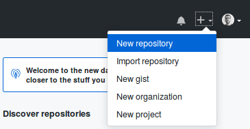

We choose a name, a small description and toggle public/private (here for an ongoing project I would likely choose 'private') and click *(Create reopsitory)*.

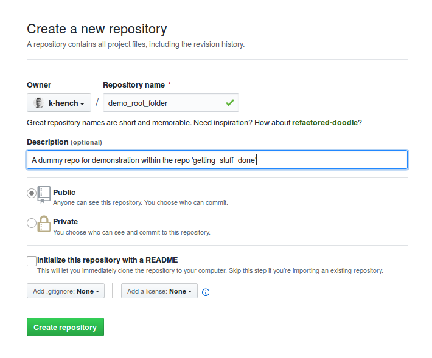

Then we switch back to the *command line*:

Within the `root_folder` we now create a connection to the new *github repository* which we set to be the *origin* of our local project:

<div class="kclass">
```sh
git remote add origin https://github.com/k-hench/demo_root_folder.git
git push -u origin master
#> Counting objects: 8, done.
#> Delta compression using up to 4 threads.
#> Compressing objects: 100% (4/4), done.
#> Writing objects: 100% (8/8), 652 bytes | 0 bytes/s, done.
#> Total 8 (delta 0), reused 0 (delta 0)
#> To https://github.com/k-hench/demo_root_folder.git
#>  * [new branch]      master -> master
#> Branch master set up to track remote branch master from origin.
```
</div>

Now we can see the content of our `root_folder` showing up on our github account:

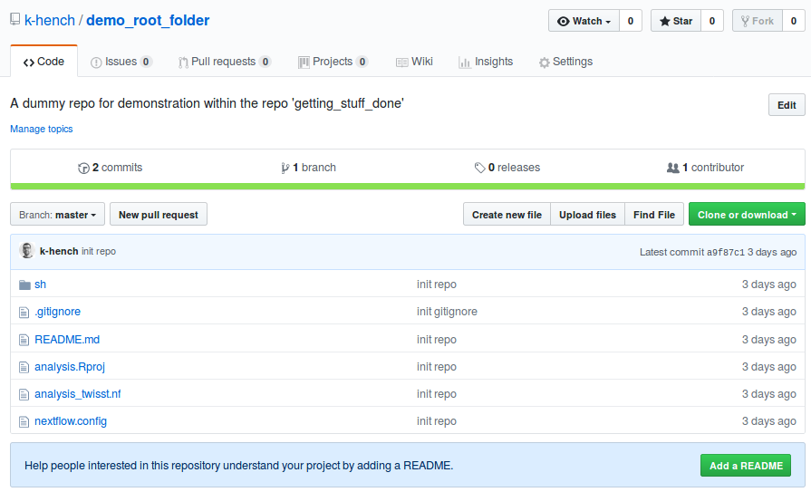

By clicking the *"commits"* tab:  
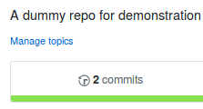,  
we can see the history of our repository.
These are all the snapshots we took so far, so we find the changes to the `.gitignore` and the subsequent import of the folder content:

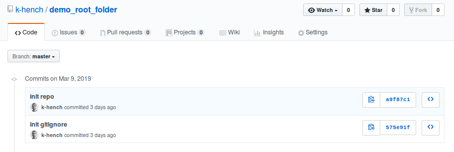

### Get the repository from *github*

At this point we can import the repository to other locations from github.
This could be to your collaborators computer, to a reviewer of your paper or to *the cluster*.

In my opinion, the beauty of using github it that we can use it for different purposes depending on the stage of our project:

- Moving content (new scripts) from your machine to the cluster (*devellopment phase*)
- Backup & documentation of the project (*constatntly from beginning to end*)
- Publication of the workflow (*after/at publication of the study*)

Actually that's probably even the more lame aspects of using git, for as far as I understand the *actual* benefits start to kick in once you work collaboratively on a single project with other people.

Importing the repository to the cluster is easy now.
We simply copy the repository URL from github:

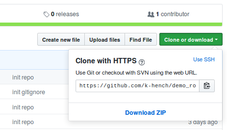

Then we log in to the cluster and *clone* the repository.
This will download it to the current directory on the cluster:

<div class="cluster kclass">
```sh
cd $WORK
git clone https://github.com/k-hench/demo_root_folder.git
#> Cloning into 'demo_root_folder'...
#> remote: Enumerating objects: 8, done.
#> remote: Counting objects: 100% (8/8), done.
#> remote: Compressing objects: 100% (4/4), done.
#> remote: Total 8 (delta 0), reused 8 (delta 0), pack-reused 0
#> Unpacking objects: 100% (8/8), done.

cd demo_root_folder/
ls -1a
#> .
#> ..
#> .git
#> .gitignore
#> README.md
#> analysis.Rproj
#> analysis_twisst.nf
#> nextflow.config
#> sh
```
</div>

You might notice that not all the files & folders made it to the cluster though:

<div class="row kclass"><div class="column">
```sh
tree
#> .
#> |-- analysis.Rproj
#> |-- analysis_twisst.nf
#> |-- data
#> |   |-- genotypes.vcf.gz
#> |   |-- table1.txt
#> |   `-- table2.txt
#> |-- docs
#> |-- nextflow.config
#> |-- py
#> |-- R
#> |-- README.md
#> `-- sh
#>     `--  script.sh
#> 
#> 5 directories, 8 files
```
</div><div class="column cluster">
```bash
tree 
#> .
#> |-- README.md
#> |-- analysis.Rproj
#> |-- analysis_twisst.nf
#> |-- nextflow.config
#> `-- sh
#>     `-- script.sh
#> 
#> 1 directory, 5 files


```
</div></div>

So of course the files that are listed on the `.gitignore` file, but also empty folders are omitted and not exported to github.

### Update the repository

Now, lets see how to update the content.

I usually write the code of my analysis on my laptop and then use github to transfer it to the cluster.
To emulate this, lets put some information into the `README.md` file.
By default, this file serves as welcome message on the github project page.

Therefore I'll open the file in a text editor and copy this text:

> Hello world,
>
> This is a showcase repository for my bioinformatics crash course.
>
> For more information please go to my repository \*getting_stuff_done\* or look 
[here]\(https://k-hench.github.io/getting\_stuff\_done/git.html\#conecting-to-github).

After saving the changes, if we check the repository status in the command line, we'll get:

<div class="kclass">
```sh
git status
#> On branch master
#> Your branch is up-to-date with 'origin/master'.
#> Changes not staged for commit:
#>   (use "git add <file>..." to update what will be committed)
#>   (use "git checkout -- <file>..." to discard changes in working directory)
#> 
#> 	modified:   README.md
#> 
#> no changes added to commit (use "git add" and/or "git commit -a")
```

So git is aware that *something has changed*.
Like before, we'll use `git add .` and `git commit -m "update README.md"` to save the new changes:

```sh
git add .
git commit -m "update README.md"
#> [master c4d6df5] update README.md
#>  1 file changed, 6 insertions(+)
git status
#> On branch master
#> Your branch is ahead of 'origin/master' by 1 commit.
#>   (use "git push" to publish your local commits)
#> nothing to commit, working directory clean
```
</div>

Getting the updates to the cluster is a two-step process:

- `git push` the changes from the laptop to github

<div class="cluster">
- `git pull` the update from github to the cluster
</div>

<div class="kclass">
```sh
git push origin master
#> Counting objects: 3, done.
#> Delta compression using up to 4 threads.
#> Compressing objects: 100% (3/3), done.
#> Writing objects: 100% (3/3), 429 bytes | 0 bytes/s, done.
#> Total 3 (delta 1), reused 0 (delta 0)
#> remote: Resolving deltas: 100% (1/1), completed with 1 local object.
#> To https://github.com/k-hench/demo_root_folder.git
#>   a9f87c1..c4d6df5  master -> master
```
<div class="cluster">
```sh
git pull origin master
#> remote: Enumerating objects: 5, done.
#> remote: Counting objects: 100% (5/5), done.
#> remote: Compressing objects: 100% (2/2), done.
#> remote: Total 3 (delta 1), reused 3 (delta 1), pack-reused 0
#> Unpacking objects: 100% (3/3), done.
#> From https://github.com/k-hench/demo_root_folder
#>  * branch            master     -> FETCH_HEAD
#>    a9f87c1..c4d6df5  master     -> origin/master
#> Updating a9f87c1..c4d6df5
#> Fast-forward
#>  README.md | 6 ++++++
#>  1 file changed, 6 insertions(+)
```
</div></div>

Also, now our `README.md` is visible on the github project page (and we can see the new commit):

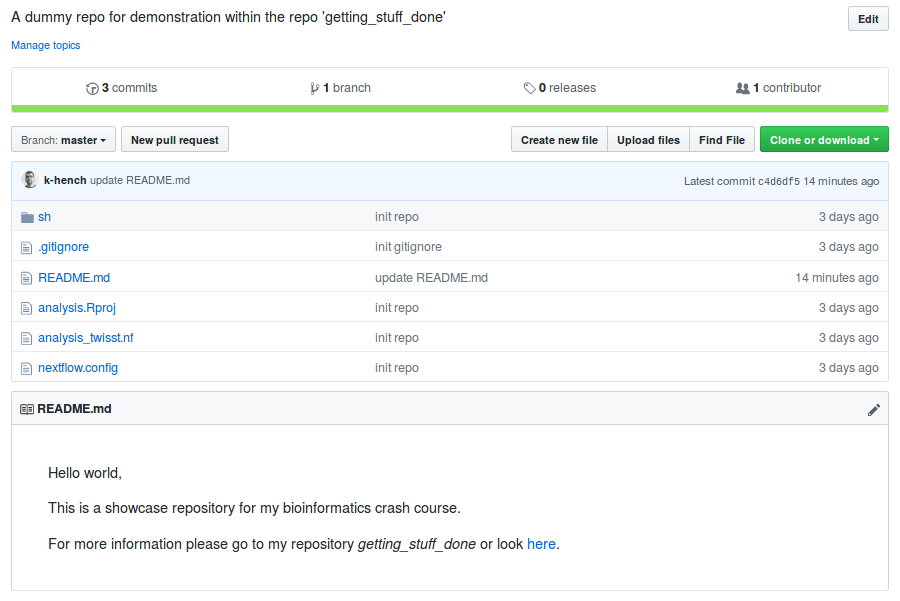

At this point we have the basics to develop our project locally, synchronizing the scripts with the cluster (where the heavy duty jobs will be run) and also keep track of the development of our project (Using version control instead of [horrible file names](http://phdcomics.com/comics/archive.php?comicid=1531)).

## Using git with Atom

Writing all those `git add .` & `git commit` commands might look tedious and impractical.
Luckily, this pain is greatly reduced when using *Atom* or a similar text editor as project manager.

When opening a folder with Atom I usually see three panels (from left to right):

- The *file tree* that gives on overview over the content of the project
- The *editor area* in the middle
- The *git tab* showing the current git status

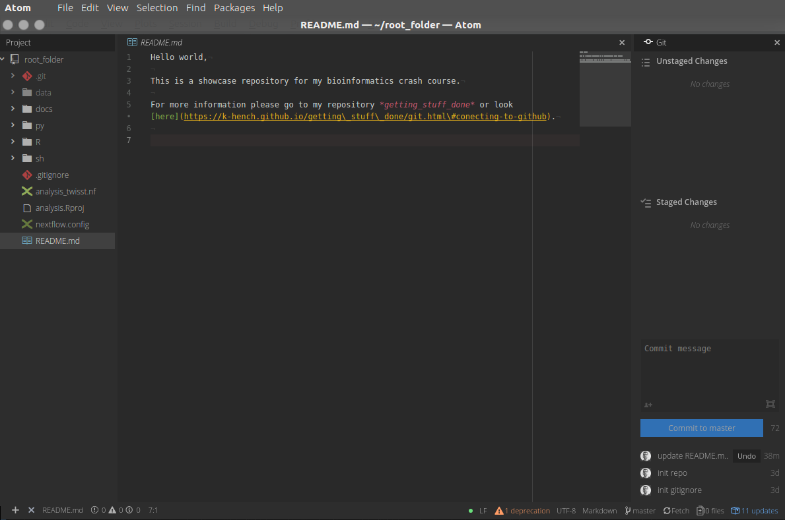

If your Atom opens with a blank file instead of a project folder you can open it manually:

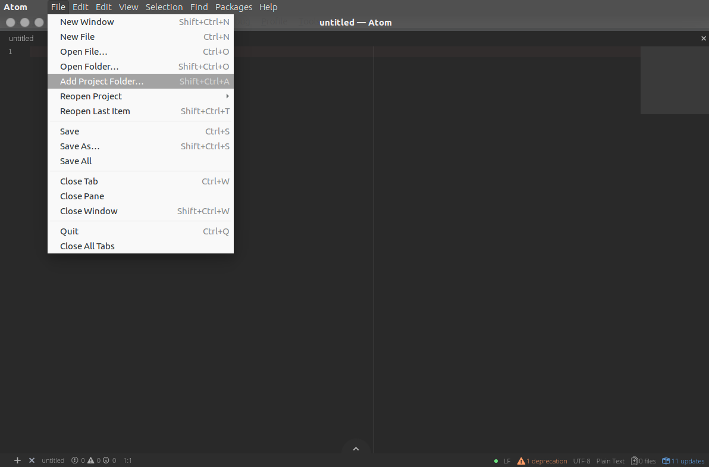

You can also toggle the *git tab* under the menu item *View*:

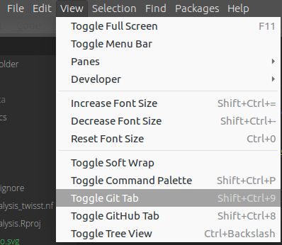

Now we make some changes to `README.md` and import the hamlet logo into the project.
In the screenshot below I:

- saved the file changes
- imported the logo
- staged the addition of the logo (equivalent to `git add logo.svg`)
- added the committing comment (equivalent to `git commit -m "add hamlet logo."`)

You can also easily push changes to github after dong a commit (the *fetch* at the button turns into *push*).

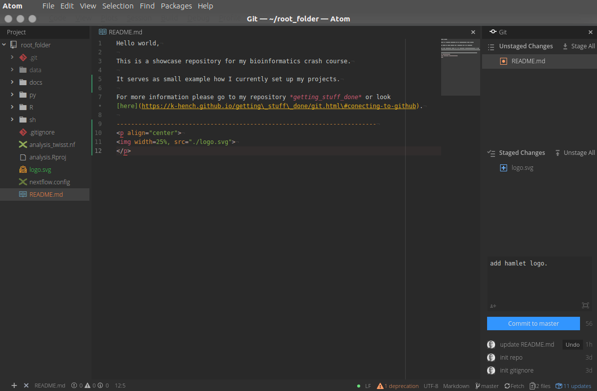

There are a [ton of extensions](https://atom.io/packages) for Atom out there, so you can [custoomize it to your needs](https://www.shopify.com/partners/blog/best-atom-packages-2017).
One example is the [mini map](https://atom.io/packages/minimap) of the code that you see to right inside the editor tab.

--------