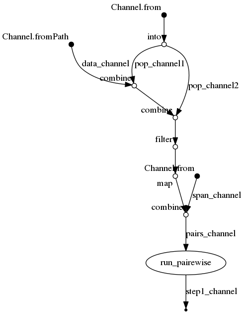

```{r, echo = FALSE}
knitr::knit_hooks$set(source = function(x, options) {
  if (!is.null(options$hilang)) {
      code_open <- "\n\n<div class=\"sourceCode\">\n<pre class=\"sourceCode\">\n<code class=\"sourceCode\">"
      code_close <- "\n</code>\n</pre>\n</div>\n"
      code_body <- highr::hi_andre(x, language = options$hilang, format = "html")
    stringr::str_c(
      code_open,
      knitr:::indent_block(paste(code_body, collapse = '\n'), ""),
      code_close
    )
  } else {
    stringr::str_c("\n\n```", tolower(options$engine), "\n",
                   paste(x, collapse = '\n'), "\n```\n\n")
      
  }
})
```

# Nextflow

This is awesome!
[*Nextflow*](https://www.nextflow.io/index.html) provides a neat way to develop and structure the *entire workflow* of you analysis in a *single script*.
It makes a huge difference for one aspect I mentioned in Chapter 2:

*"Apart from the scripts you ran, people need to know what to run when and where."*
*"At least for me, it is usually quite hard even to recall the exact order of my own scripts needed for a complex data analysis [...] when I come back half a year later[...]."*

Apart from this using Nextflow can save you *a lot* of mindless typing when doing different versions of a similar analysis.
The drawback is that you need to get a basic Idea of yet another language (Nextflow is based on [*groovy*](https://en.wikipedia.org/wiki/Apache_Groovy)).

But the Nextflow [documentation](https://www.nextflow.io/docs/latest/index.html) is pretty good.
Reading through the manual took me quite some time but the time I saved since then more than compensated pretty quickly.
Also, if you have questions beyond what is covered in the manual, the help provided on [*gitter*](https://gitter.im/nextflow-io/nextflow) is amazing.
So far any question I asked there was solved within about 30 min!
(Of course it important not to spam the people there with unnecessary questions - so first: *RTFM*)

## Basics

The basic Idea of Nextflow is that it will connect different task that you do within *bash* (or any other scripting language) in an organized but dynamic manner.
It then manages your analysis for you (waiting for job *A* to finish before submitting job *B*) and can manage quite a lot of different cluster scheduling systems.
You can use it from the very beginning of your project since it is able to resume a previous run:
So if you first implement *job A* and then (while *job A*) is running write *job B* you can simply update your nextflow script.
If you then resume the run, nextflow will remember that it already ran *job A* and start with *job B* straight away.
This is also great if you later need to change a *middle part* of your analysis - nextflow will basically only rerun what is needed downstream from the the point that you changed.
This is super convenient.

To run a nextflow pipeline I usually prepare two scripts:

- `analysis.nf`: this is the actual pipeline 
- `nextflow.config`: this is the configuration script (important on the cluster, for small local test not so much)

### The pipeline script

The `analysis.nf` is where you put together you analysis.
For me, this means that it is basically a series interconnected *bash* snippets.

The nextflow script is build from three types of building blocks:

- *Processes*: the *bash* snippets that contain the code I would otherwise type into the terminal
- *Channels*: streams of files you put through you pipeline, or streams of parameter values you want vary within your analysis
- *Operators*: connect the different Processes and Channels using logic (linear, crosses), or modify a channel along the way (filtering, merging, sorting)

**Processes**

A nextflow process looks like this:

<div class="kclass">
```{r , eval = FALSE, hilang = 'nf'}
process gather_depth {
	label 'L_loc_test_script'
	publishDir "export_folder", mode: 'copy'

	input:
	set val( input_val ), file( input_file ) from input_channel

	output:
	file( "${input_val}.txt" ) into output_channel
	
	script:
	"""
	 sed 's/X-TAG-X/${input_val}/g' ${input_file} > ${input_val}.txt
   cat \$HOME/signature.txt >> ${input_val}.txt
	 """
}
```

This breaks down into different compartments: 

```{r , eval = FALSE, hilang = 'nf'}
process /* <process_name> */ {
	/* <config section> */

	input:
	/* <input channel> */

	output:
	/* <output channel> */
	
	script: /* <task> */
	"""
    # some bash code
    """
}
```

In the **config section** we can assign the process to a label (to use specific config settings defined in `nextflow.config`).
Here we can also specify if we want to collect the output of the script outside of the `work` folder which is used by nextflow for the execution of the code.
You can also activate conda environments or load modules for this process here.

The **input** and **output** sections are used to connect the individual processes and to manage the flow of files and values from process to process.

The **script** section contains the actual code to run.
Here, you write the actual bash code of the pipeline.

Careful when using bash variables (eg `$WORK`) within nextflow.
Nextflow itself uses the dollar sign (`$`) to assign its own variables (eg `${input_val}`) in the example scripts.
These are evaluated before the scripts is run and replaced by the appropriate file/value.
If you want to use bash variables that are supposed to be evaluated when the script is actually run, you need to conserve the dollar sign by *escaping* the dollar sign (`cat \$HOME/signature.txt` instead of `cat $HOME/signature.txt`).  

**Channels**  

These are the streams of *files* or *values*.
One channel could be eg. all the sequencing files you need to process, while another one could be all the values of an input parameter of of a model that you wish to test for different input settings.

Channels connect the different processes and Nextflow basically follows development of the stating channels during the development through the different steps of your pipeline.
You feed a channel into a process in the *input* section, while the *output* section emits a new channel.
</div>


At the start of your pipeline you will need to define some channels like this:

```{r , eval = FALSE, hilang = 'nf'}
Channel.from( 'A' 'B' 'C' )
Channel.from( ('01'..'09') + ('10'..'19'))
Channel.fromPath( 'genotypes.vcf.gz' )
Channel.fromPath( 'sequencing_data/*.fq.gz' )
```

**Operators**  

Operators contain the *actions/logic* that connects different elements of your pipeline.
You can use them to modify your channels by exposing them to filtering, transformations, splitting, merging.
We already saw two operators in the example above (`.from()` & `.fromPath()`).
So you can see that the have form of *dot*-*name()* (or *dot*-*name{}* ).

Operators (besides `.from()`, `.fromPath()` $ `.fromFilePairs()`) I frequently use are:

<div class="row kclass"><div class="column">
- `.splitCsv()`: read csv (combined variables)
- `.set{}`: channel name (single copy)
- `.into{}`: channel name (multiple copies)
- `.map{}`: transform channel content
</div><div class="column">
- `.collect()`: collapse the channel
- `.combine()`: cross of two channels
- `.join()`: merge two channels (sorted)
- `.groupTuple()`: collapse the channel (sorted)
</div></div>

## A quick example

I want to create a quick example of the power of nextflow.
Therefore lets assume we have to do a analysis where we have a set of populations that need to be compared pairwise (eg. calculate pairwise *F<sub>ST</sub>* along the genome).
After this you want to do a running average using different window sizes.

*I will use dummy commands here to show the workings of nextflow rather than doing an meaningful analysis*:

```sh
cd ~/root_folder
echo "I am the input data" > data_file.txt
```

The beauty of nextflow is that you basically just have to write the script for a single case.
(You can check the complete nextflow on the [demo_root_folder reopsitory](https://github.com/k-hench/demo_root_folder))
First we initialize the different *Channels* within our pipeline script.

<div class="kclass">
```{r , eval = FALSE, hilang = 'nf'}
Channel
	.fromPath("data_file.txt")
	.set{ data_channel }

Channel
	.from( [[1, "popA"], [2, "popB"], [3, "popC"]] )
	.into{ pop_channel1; pop_channel2 }

Channel
	.from( "10kb" "50kb" )
	.set{ span_channel }
```

Then, we combine the different channels using operators:

```{r , eval = FALSE, hilang = 'nf'}
data_channel                 /* start with the raw data */
	.combine( pop_channel1 )  /* add pop1 to data */
	.combine( pop_channel2 )  /* cross with pop2 */
	.filter{ it[1] < it[3] }  /* discad the upper triangle of the cross */
	.map{ it[0,2,4]}          /* select only data & pops (remove indexes) */
	.combine( span_channel )  /* cross with sensitivities */
	.set{ pairs_channel }     /* name output channel */
```

Finally, we run the actual bash commands:

```{r , eval = FALSE, hilang = 'nf'}
process run_pairewise {
	publishDir "output/${span}", mode: 'copy'

	input:
	set file( data ), val( pop1 ), val( pop2 ), val( span ) from pairs_channel

	output:
	file( "step1.${pop1}-${pop2}.${span}.txt" ) into step1_channel

	script:
	"""
	cat ${data} > step1.${pop1}-${pop2}.${span}.txt                 # check data content
	echo "${pop1} vs. ${pop2}" >> step1.${pop1}-${pop2}.${span}.txt # run pairewise 'fst'
	echo "-- ${span} --" >> step1.${pop1}-${pop2}.${span}.txt       # running average
	"""
}
```

That's all it takes:

```sh
cd ~/root_folder
ls -1
#> analysis.Rproj
#> analysis_twisst.nf
#> data
#> data_file.txt
#> docs
#> logo.svg
#> nextflow.config
#> py
#> R
#> README.md
#> sh
nextflow run analysis_twisst.nf 
#> N E X T F L O W  ~  version 0.31.1
#> Launching `analysis_twisst.nf` [gloomy_goldstine] - revision: 5e861dc34e
#> [warm up] executor > local
#> [d7/fccc1d] Submitted process > run_pairewise (1)
#> [5d/285ab0] Submitted process > run_pairewise (4)
#> [90/f10c05] Submitted process > run_pairewise (2)
#> [5c/371178] Submitted process > run_pairewise (3)
#> [79/c63706] Submitted process > run_pairewise (5)
#> [4a/ccae53] Submitted process > run_pairewise (6)
ls -1a
#> .
#> ..
#> analysis.nf
#> analysis.Rproj
#> data
#> data_file.txt
#> docs
#> .git
#> .gitignore
#> logo.svg
#> .nextflow         <- folder created by nextflow
#> nextflow.config
#> .nextflow.log     <- logfile created by nextflow
#> output            <- folder created by nextflow
#> py
#> R
#> README.md
#> sh
#> work              <- folder created by nextflow
tree output/
#> output/
#> ├── 10kb
#> │   ├── step1.popA-popB.10kb.txt
#> │   ├── step1.popA-popC.10kb.txt
#> │   └── step1.popB-popC.10kb.txt
#> └── 50kb
#>     ├── step1.popA-popB.50kb.txt
#>     ├── step1.popA-popC.50kb.txt
#>     └── step1.popB-popC.50kb.txt
#> 
#> 2 directories, 6 files
cat output/10kb/step1.popA-popC.10kb.txt 
#> I am the input data
#> popA vs. popC
#> -- 10kb --
```

We can see that the three pair wise comparison were completed for both averaging sensitivities,
since all the expected output files show up in the output folder.

But nextflow created a few more files and folders:

- `.nextflow`: the folder where nextflow does its housekeeping
- `.nextflow.log`: the log of the nextflow run
- `output`: the output folder (we specifically asked for this one within the process)
- `work`: the folder where nextflow executes the scripts. The weird prefixes (eg. `[d7/fccc1d]`) in the terminal output refer to sub directories of `work`

Of course I don not want *git* to remember the whole messy nextflow inner workings (the scripts is enough).
So, I quickly add those files to the `.gitignore` (make sure to use double `>>`!).

```sh
echo ".nextflow*" >> .gitignore
echo "work" >> .gitignore
echo "output" >> .gitignore
```

Now, we made some changes - so lets update the repository (and github).
First, only the `.gitignore`. 

```sh
git status
#> On branch master
#> Your branch is up-to-date with 'origin/master'.
#> Changes not staged for commit:
#>   (use "git add/rm <file>..." to update what will be committed)
#>   (use "git checkout -- <file>..." to discard changes in working directory)
#> 
#> 	modified:   .gitignore
#> 	modified:   analysis.nf
#> 
#> Untracked files:
#>   (use "git add <file>..." to include in what will be committed)
#> 
#> 	data_file.txt
#> 
#> no changes added to commit (use "git add" and/or "git commit -a")
git add .gitignore
git commit -m "update .gitignore"
#> [master 5de89de] update .gitignore
#>  1 file changed, 3 insertions(+)
```

Then we add the rest:

```sh
git status
#> On branch master
#> Your branch is ahead of 'origin/master' by 1 commit.
#> Changes not staged for commit:
#>   (use "git add/rm <file>..." to update what will be committed)
#>   (use "git checkout -- <file>..." to discard changes in working directory)
#> 
#> 	modified:   analysis.nf
#> 
#> Untracked files:
#>   (use "git add <file>..." to include in what will be committed)
#> 
#> 	data_file.txt
#> 
#> nothing added to commit but untracked files present (use "git add" to track)
git add .
git commit -m 'pipeline update'
#> [master 557d3d7] pipeline update
#>  2 files changed, 41 insertions(+)
#>  create mode 100644 data_file.txt
git status
#> On branch master
#> Your branch is ahead of 'origin/master' by 2 commits.
#>   (use "git push" to publish your local commits)
#> nothing to commit, working directory clean
git push origin master
#> Counting objects: 13, done.
#> Delta compression using up to 4 threads.
#> Compressing objects: 100% (10/10), done.
#> Writing objects: 100% (13/13), 1.74 KiB | 0 bytes/s, done.
#> Total 13 (delta 4), reused 0 (delta 0)
#> remote: Resolving deltas: 100% (4/4), completed with 1 local object.
#> To https://github.com/k-hench/demo_root_folder.git
#>    d8b99be..557d3d7  master -> master
```
</div>

<div class="cluster">
Now, in the *real world*, I would write the nextflow script locally.
Then I would commit my changes to github and pull them onto the cluster from there.
Finally I would run nextflow on the cluster (`nextflow run analysis.nf`).
</div>

## Managing the workflow on the cluster 

<div class="cluster">
The nice thing about running nextflow on the cluster is, that it works pretty much the same as locally - so you don't have to deal with submitting jobs because nextflow will take care of this.

The tricky part about this is that you will need to keep nextflow running for the whole time - yet we still want to be able to log out from the cluster and shut down the laptop at the end of the day (and not keep an open ssh session for 10 days until the analysis has finished).

For this we can use [`screen`](https://www.tecmint.com/screen-command-examples-to-manage-linux-terminals/).
Basically we create a *virtual session* that will continue to run even if we log out from the cluster (even though we thereby close the session that created it in the first place).
This is ideal for our nextflow needs: It enables us to
</div>

1. to log on to the cluster and create a screen session
2. start the nextflow pipeline from *within screen*
3. *detatch* from the screen session by pressing `<<ctrl><a>> <<ctrl><d>>`
4. log out from the cluster shut down our laptop
5. (two days later) log on to the cluster
6. *reattach* to the old screen session `<screen -DR>` or `screen -d -r <session-id>`
7. check if nextflow is still running (and kill it since we by now found a typo in the pipeline...)

<div class="kclass">
```sh
screen -S test
while sleep 5; do date;done 
# <<ctrl><a>> <<ctrl><d>> (detach)
#> [detached from 14079.test]
screen -ls
#> There are screens on:
#> 	14079.test	(13.03.2019 13:52:30)	(Detached)
#> 	6972.Tel	(13.03.2019 10:53:32)	(Detached)
#> 2 Sockets in /var/run/screen/S-khench.
screen -d -r 14079
#> Mi 13. Mär 13:52:52 CET 2019
#> Mi 13. Mär 13:52:57 CET 2019
#> Mi 13. Mär 13:53:02 CET 2019
#> Mi 13. Mär 13:53:07 CET 2019
#> Mi 13. Mär 13:53:12 CET 2019
#> Mi 13. Mär 13:53:17 CET 2019
#> Mi 13. Mär 13:53:22 CET 2019
#> Mi 13. Mär 13:53:27 CET 2019
# <<ctrl><c>> (kill while loop)
#> ^C
exit
#> [screen is terminating]
screen -ls
#> There is a screen on:
#> 	6972.Tel	(13.03.2019 10:53:32)	(Detached)
#> 1 Socket in /var/run/screen/S-khench.
```
</div>

There is one more trick when using screen with the cluster:

My metaphor with the hotel was not exactly accurate (surprise...).
That is because there are actually three log in nodes instead of a single one and with the standard log in, the log in node is chosen at random (I think).

Now if you start a screen session on on log in node and later log on to a different one, you will not find you screen session back.
Luckily, you also choose a specific log in node by using eg `nesh-fe2` instead of `nesh-fe2`.

To make things a little easier, I added these two lines to my `~/.bashrc` file:

```sh
alias toNEC="ssh smomw000@nesh-fe1.rz.uni-kiel.de"
alias mountNEC="sshfs smomw000@nesh-fe.rz.uni-kiel.de:/sfs/fs2/work-geomar7/smomw000 ~/mnt"
```

<div class="cluster">
Of course you will need to adjust the mounting path to match your `$WORK` directory on the cluster.
</div>

Now, all I need to type to mount/log on to the cluster is `toNEC` or `mountNEC` and I will always log onto the same log in node.


## The config script

The `nextflow.config` sets up some global setting for your nextflow run.
To use the NEC computer cluster from Uni Kiel, I add this section to the config script:

<div class="kclass">
```
env.BASE_DIR = "$WORK/project_dir"

process {
   executor = 'nqsii'
   queue = 'clmedium'
   cpus = 1
   memory = 4.GB
   time = { 1.h * task.attempt }
   errorStrategy = { task.exitStatus == Integer.MAX_VALUE ? 'retry' : 'finish' }
   maxRetries = 1
   maxErrors = '-1'
   
   	 withLabel: "L_loc.*" {
	 executor='local'
	 }

	 withLabel: "L_20g15m_.*" {
       queue = 'clexpress'
       memory = 20.GB
       time = { 15.m * task.attempt }
    }
    
    withLabel: "L_---_.*" {
       clusterOptions = '---'
       queue = '---'
       memory = ---.GB
       cpus = ---
       time = { ---.h * task.attempt }
    }
}

trace { enabled = true }
report { enabled = true }
```
</div>

So, I set at few defaults for the jobs, and then stat defining different the types of processes that I reference within the `analysis.nf` script.
Please refer to [nextflow documentation](https://www.nextflow.io/docs/latest/config.html#scope-process) for the different options set within the process section.

Apart from this, I also provide the path to the project folder and turn the *trace* and the *report* on by default.

## Quick recap

So, in a nutshell my workflow with nextflow is as follows

1. Initialize the repository (including the `analysis.nf`) locally
2. Push to github
3. Pull to cluster
4. Start nextflow (cluster)
5. develop further steps & correct bugs of the `analysis.nf` (locally)
6. update github & cluster
7. resume nextflow to run the new parts of the pipeline (cluster)
8. rinse and repeat until the analysis is complete

To resume a nextflow run:

<div class="cluster">
```sh
cd $WORK/root_folder
nextflow run analysis.nf -c nextflow.config -resume
```
</div>

By the way - you can also toggle a nice graphical summary of your pipeline using `nextflow run analysis.nf -with-dag analysis.png -c nextflow.config -resume`:



--------